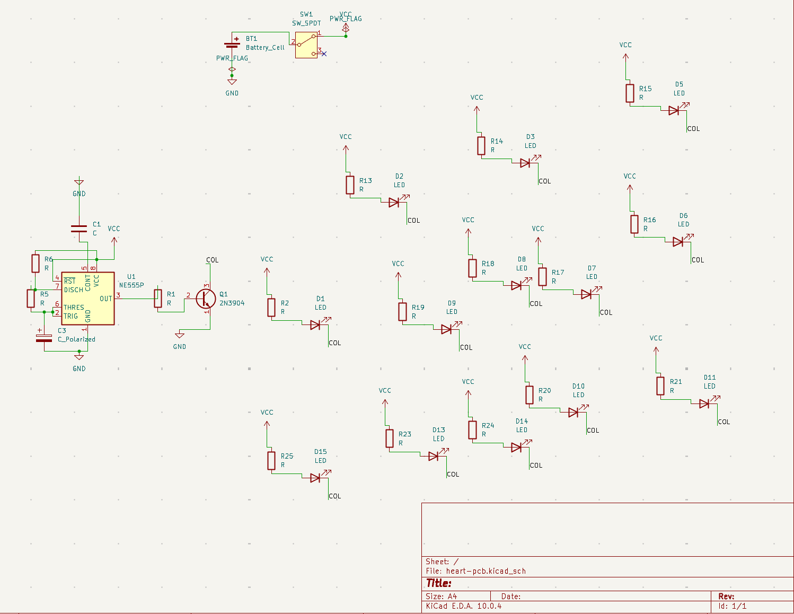

# Heart-Shaped LED PCB

A 100 × 100 mm heart-outline PCB driving LEDs from a 555 astable oscillator, powered by a
CR2032 coin cell. Designed from scratch in KiCad, fabricated at JLCPCB, and hand-assembled.
First PCB I've designed and my first time soldering.


## Circuit

A 555 timer in astable configuration generates a square wave; the output drives the LED
array through <!-- REPLACE: a transistor? a current-limiting resistor per LED? describe the
actual output stage --> so the heart blinks at roughly <!-- REPLACE: frequency --> Hz.

| Block | Parts | Notes |
|---|---|---|
| Timing | NE555, R<!--?-->, C<!--?--> | Sets blink rate; f ≈ 1.44 / ((R1 + 2·R2)·C) |
| Output | <!-- REPLACE --> | <!-- REPLACE: why this drive scheme --> |
| Power | CR2032 in BT1 holder | 3 V, THT holder |



## Layout

The board outline is a heart drawn on Edge.Cuts rather than a rectangle, which drove most of
the layout decisions: LEDs are placed to trace the outline, and routing had to work around
the concave notch at the top and the point at the bottom where there's no copper area to
route through.


Two problems worth calling out from the design phase:

- **LED polarity reversed.** Caught during schematic review before ordering — the footprint
  pin mapping didn't match the symbol orientation I'd assumed. If it had shipped, none of the
  LEDs would have lit and the board would have been scrap.
- **DRC violations from through-hole component stacking.** The initial placement put THT
  courtyards on top of each other in the tight areas of the outline. `DRC.rpt` in `docs/` is
  the report from that first pass, kept as a record of what the layout looked like before I
  fixed it.

## Bring-up

Assembly went in one pass except for the coin cell holder. On first power-up the board did not
come alive. Debugging got as far as a continuity failure I narrowed to two candidates:
flux residue bridging or absorbing across the pads, or a cold joint on the transistor —
I didn't have isopropyl on hand to rule out the first, which is the more likely of the two.
I gave the board away before finishing the diagnosis, so it stands unresolved.

What I'd do differently, in order of how much it would have helped:

1. Keep isopropyl and a flux-cleaning step in the assembly loop, not as an afterthought.
2. Add test points on the 555 output and the supply rail so bring-up is measure-first rather
   than guess-first.
3. Power the first article from a bench supply with current limiting instead of a coin cell —
   a CR2032 tells you nothing about whether you have a short.

## Repository contents

```
heart-pcb.kicad_sch     schematic
heart-pcb.kicad_pcb     board layout
heart-pcb.kicad_pro     project file
gerbers/                fabrication output sent to JLCPCB
docs/                   renders, schematic plot, first-pass DRC report
```

## Tools

KiCad, JLCPCB for fabrication, hand assembly with a soldering iron.
