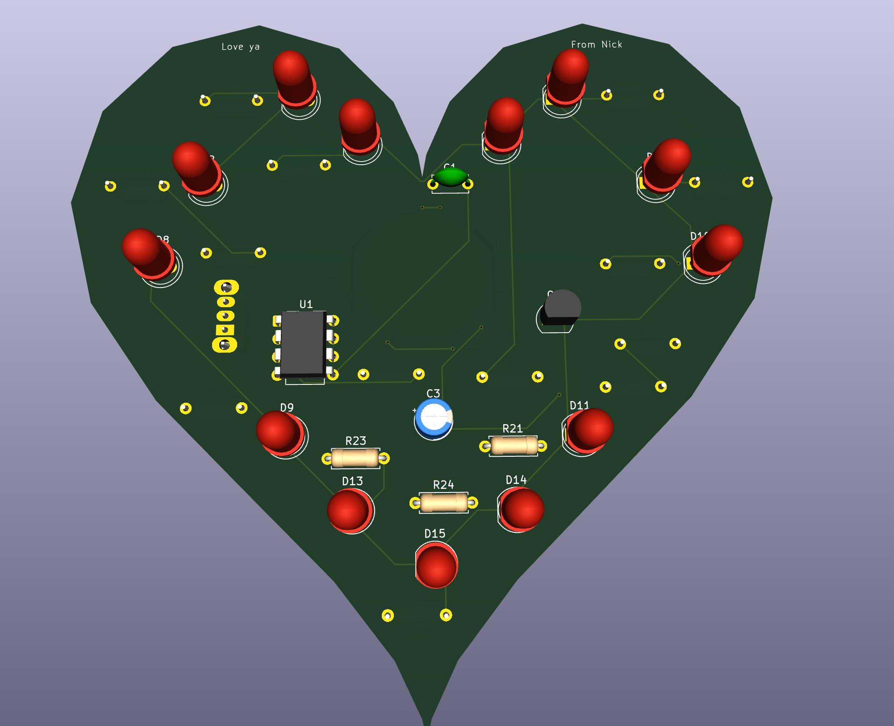
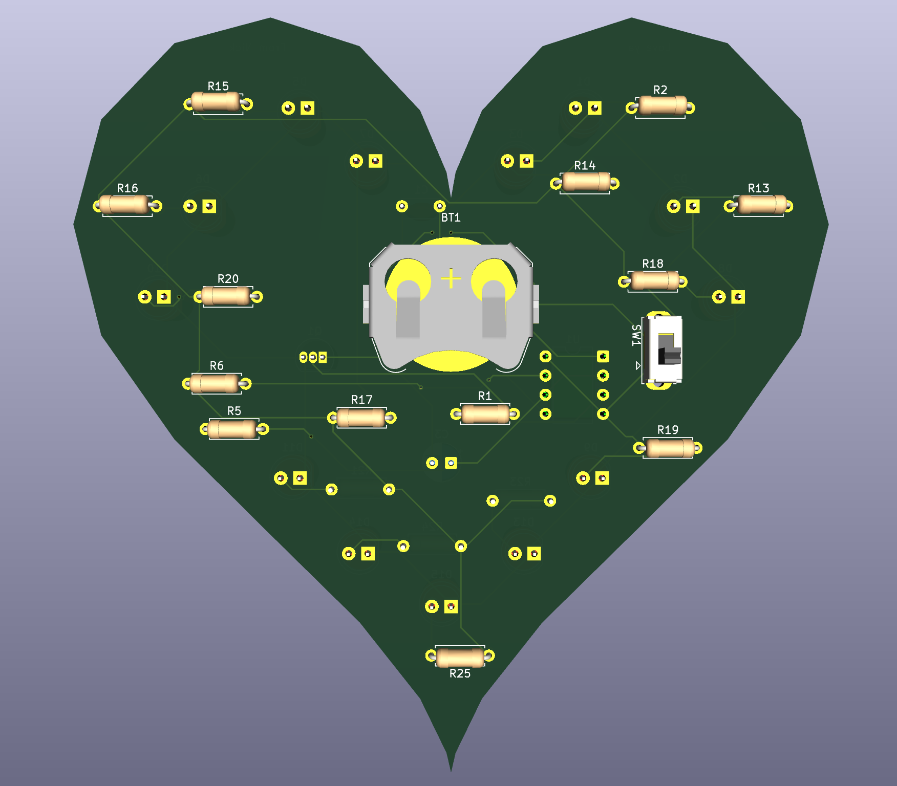
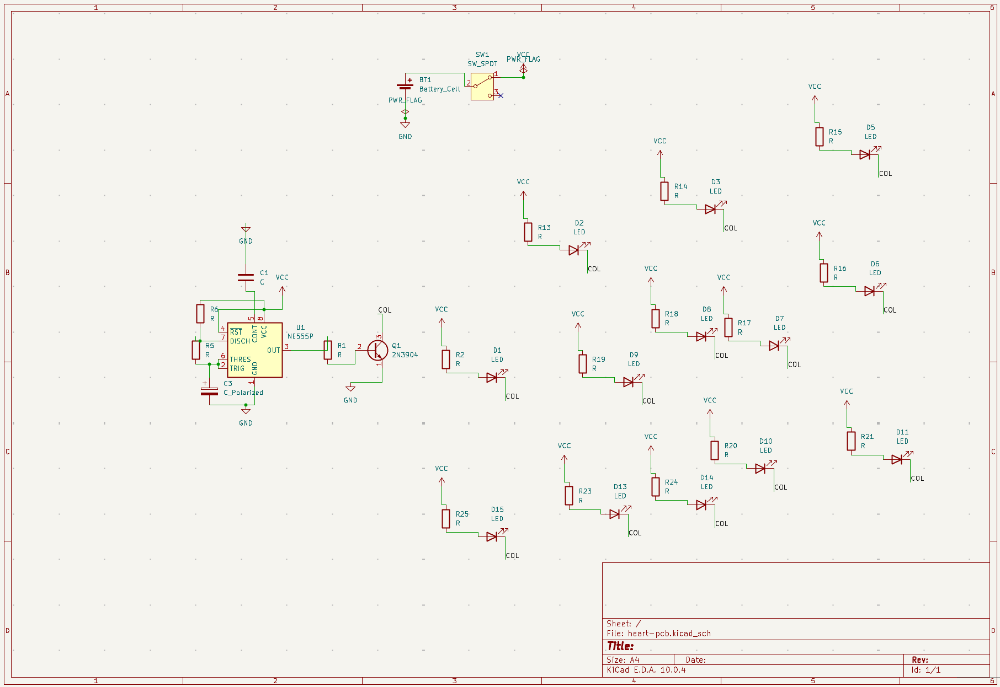
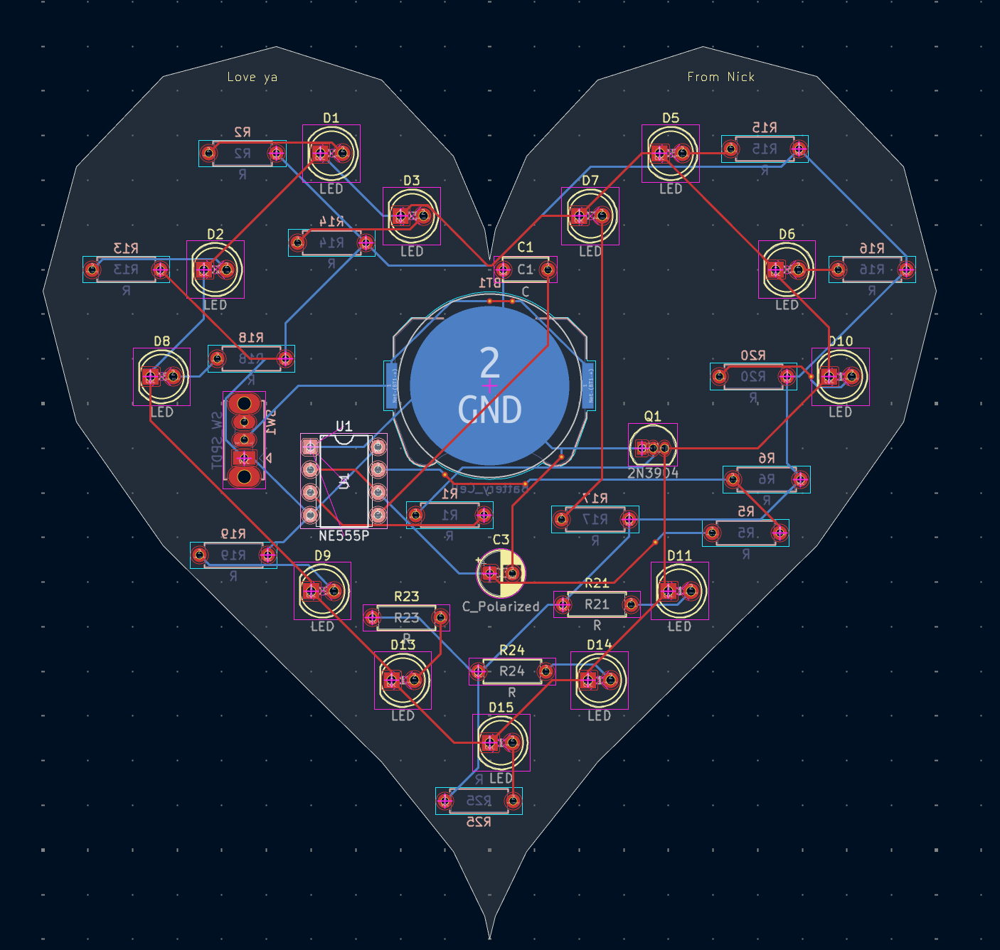

# Heart-Shaped LED PCB

A 100 × 100 mm heart-outline PCB that blinks 13 LEDs from a 555 astable oscillator, powered
by a CR2032 coin cell. Designed from scratch in KiCad, fabricated at JLCPCB, and hand
assembled — the first board I've designed and the first thing I've soldered. It was built as
a gift, which is where the outline came from.





## Circuit

U1 (NE555P, DIP-8) runs as an astable oscillator. Its output drives the base of Q1 (2N3904)
through a series resistor, and Q1 switches the shared `COL` net that all 13 LEDs sit on, so
the whole heart blinks together. The transistor is there because the 555's output pin can't
source enough current to drive 13 LEDs directly — the timer sets the rhythm, the transistor
does the work.

| Block | Parts | Notes |
|---|---|---|
| Timing | U1 NE555P, two timing resistors, C1 (ceramic disc) | f ≈ 1.44 / ((R_A + 2·R_B)·C1) |
| Switching | Q1 2N3904 + base resistor | Buffers the 555 output to drive the array |
| LEDs | 13 × 5 mm THT, one series resistor each | Common `COL` net at Q1's collector |
| Power | BT1 CR2032 (Keystone 3034 holder), SW1 SPDT slide switch, C3 electrolytic | 3 V |

Sixteen resistors total: 13 LED series resistors, 2 timing resistors, 1 base resistor.
Everything is through-hole, deliberately — it was my first board and my first time soldering,
and THT is far more forgiving of both.



## Layout

The board outline is a heart drawn on `Edge.Cuts` rather than a rectangle, and that one
decision drove most of the layout. The LEDs are placed to trace the outline, so their
positions were fixed by the shape before routing started rather than chosen for routing
convenience. Traces then had to work around the concave notch at the top and the point at
the bottom, neither of which has copper area to route through.



Two things worth calling out from the design phase:

**LED polarity reversed.** Caught during schematic review before ordering — the footprint pin
mapping didn't match the symbol orientation I'd assumed. If it had shipped, none of the LEDs
would have lit and the whole run would have been scrap.

**90 DRC violations on the first layout pass.** `docs/DRC.rpt` is that report, kept
deliberately rather than cleaned up. The breakdown is the useful part: 56 unconnected items,
27 through-holes inside courtyards, 24 solder-mask bridges, 22 clearance violations, and 11
co-located holes. The courtyard and hole errors were all the same root cause — I had placed
through-hole parts by eye along the outline without respecting their courtyards, so
footprints were physically overlapping in the tight regions of the heart. Fixing it meant
re-placing the LED ring with the courtyards visible and re-routing around it.

## Bring-up

Assembly went in a single pass except for the coin cell holder, which I never finished
soldering. On first power-up the board did not come alive. I traced it as far as a continuity
failure with two candidates — flux residue bridging across pads, or a cold joint on Q1 — and
couldn't rule out the first because I had no isopropyl on hand. I gave the board away before
finishing the diagnosis, so the fault was never conclusively found.

Reviewing the design afterwards, I think there is a more fundamental problem than either of
those, and it's a specification error rather than a workmanship one. A CR2032 has an internal
resistance in the tens of ohms and is intended for continuous loads on the order of a
milliamp. Thirteen LEDs in parallel at even 3 mA each is roughly 40 mA, which would collapse
the cell's terminal voltage below the LEDs' forward voltage. The array is very likely beyond
what that cell can supply regardless of how well the board was soldered. I chose the coin
cell because it was thin enough to sit behind the board and keep the gift self-contained, and
I never checked it against the load it had to drive.

What I'd do differently, roughly in order of how much it would have helped:

1. Size the power source against the actual load before choosing it for its form factor.
   This is the one that would have mattered most, and it's a five-minute calculation I skipped.
2. Annotate component values in the schematic. I assigned footprints but left the resistors
   and capacitors at their default library values, which makes the project hard to rebuild
   from and left me without a record of what I'd actually populated.
3. Add test points on the 555 output and the supply rail, so bring-up is measure-first
   instead of guess-first.
4. Bring the first article up on a current-limited bench supply rather than the coin cell —
   a CR2032 tells you nothing about whether you have a short.

## Repository contents

```
heart-pcb.kicad_sch     schematic
heart-pcb.kicad_pcb     board layout
heart-pcb.kicad_pro     project file
gerbers/                fabrication output sent to JLCPCB
docs/                   3D renders, schematic plot, layout view, first-pass DRC report
```

## Tools

KiCad for schematic capture and layout, JLCPCB for fabrication, hand assembly with a
soldering iron.